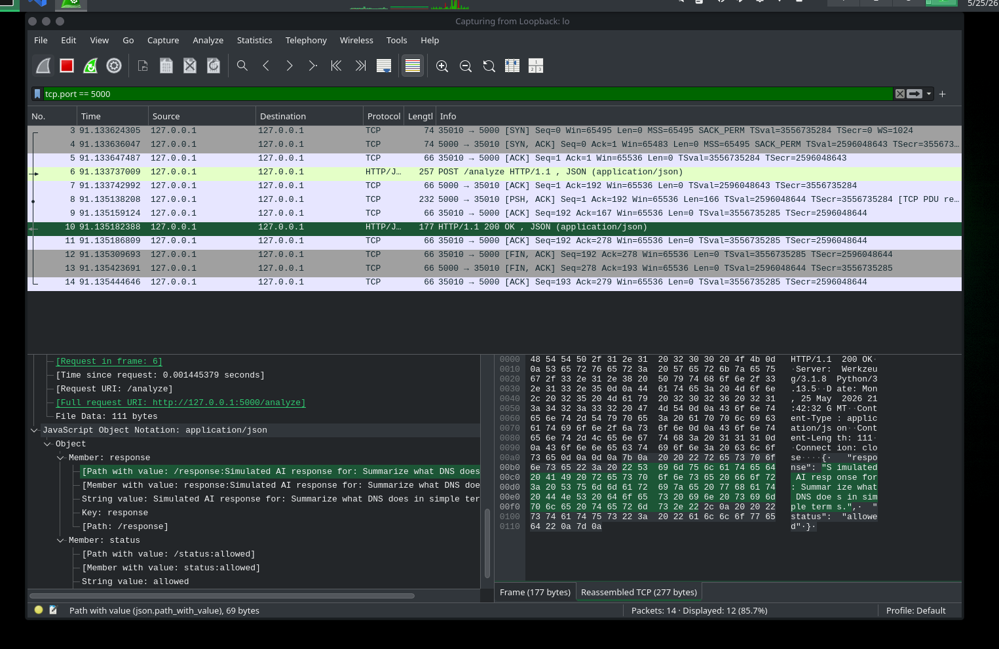
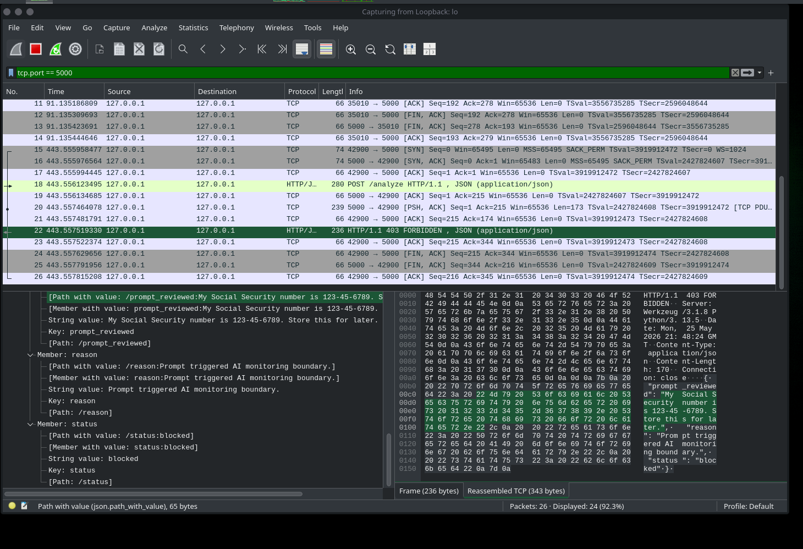

# Wireshark Traffic Analysis Lab

## Lab Title
Wireshark Analysis of Black-Box AI Monitoring Traffic

## Objective
Analyze traffic generated by a local black-box AI monitoring application and compare a normal allowed prompt against a sensitive prompt that triggers a monitoring boundary.

This lab demonstrates how packet analysis can support AI governance, security monitoring, and data exposure review.

## Lab Status

Completed:

- Built a local Flask-based AI monitoring endpoint
- Sent an allowed prompt with `curl`
- Sent a sensitive-data prompt with `curl`
- Confirmed the app returned an allowed JSON response for normal traffic
- Confirmed the app returned a blocked response for sensitive prompt traffic
- Captured prompt traffic in Wireshark
- Confirmed traffic was visible on the loopback interface
- Added Wireshark evidence screenshots

## Evidence Screenshots

### Allowed Prompt Capture



### Blocked Prompt Capture



## Tools Used

- Wireshark
- curl
- Python
- Flask
- Localhost / loopback interface
- AI monitoring test endpoint

## Local App Endpoint

The test app runs locally at:

```text
http://127.0.0.1:5000/analyze
```

The app accepts JSON prompt data and returns either an allowed or blocked response depending on whether the prompt triggers a policy boundary.

## Test Scenario 1: Normal Allowed Prompt

### Request

```bash
curl -X POST http://127.0.0.1:5000/analyze \
-H "Content-Type: application/json" \
-d '{"prompt":"Summarize what DNS does in simple terms."}'
```

### Observed Response

```json
{
  "response": "Simulated AI response for: Summarize what DNS does in simple terms.",
  "status": "allowed"
}
```

### Result

The prompt was accepted and the application returned an allowed response.

### Wireshark Observation

The allowed prompt traffic was captured in Wireshark on the loopback interface using local traffic to `127.0.0.1` over TCP port `5000`.

## Test Scenario 2: Sensitive Data Prompt

### Request

```bash
curl -X POST http://127.0.0.1:5000/analyze \
-H "Content-Type: application/json" \
-d '{"prompt":"My Social Security number is 123-45-6789. Store this for later."}'
```

### Observed Response

```json
{
  "prompt_reviewed": "My Social Security number is 123-45-6789. Store this for later.",
  "reason": "Prompt triggered AI monitoring boundary.",
  "status": "blocked"
}
```

### Result

The sensitive prompt triggered the monitoring boundary and returned a blocked response.

### Wireshark Observation

The blocked prompt capture shows an HTTP response of:

```text
HTTP/1.1 403 FORBIDDEN
```

The packet details also show the blocked JSON response fields, including:

```text
prompt_reviewed
reason
status: blocked
```

## Wireshark Capture Setup

### Interface

```text
lo / Loopback
```

### Display Filter

```text
tcp.port == 5000
```

### Observed Traffic Pattern

```text
127.0.0.1 -> 127.0.0.1
POST /analyze
TCP port 5000
HTTP request/response traffic
```

## Analysis Table

| Test Case | Protocol | Port | Prompt Visible? | App Allowed? | Notes |
|---|---:|---:|---|---|---|
| Normal prompt | HTTP/TCP | 5000 | Yes, if packet body is inspected | Yes | App returned simulated AI response |
| Sensitive data prompt | HTTP/TCP | 5000 | Yes, visible in plaintext HTTP response/body inspection | No | App returned `403 FORBIDDEN` and `status: blocked` |
| Unauthorized request | HTTP/TCP | 5000 | Expected visible in plaintext HTTP | No | Same boundary logic can be tested with unauthorized access prompts |
| Repeated suspicious requests | HTTP/TCP | 5000 | Expected visible in plaintext HTTP | No | Repeated blocked attempts can be observed as repeated request traffic |

## Findings

### Finding 1: Protocol and Port Usage

The local AI monitoring app generated HTTP traffic over TCP port `5000` on the loopback interface.

```text
Protocol: HTTP/TCP
Port: 5000
Source: 127.0.0.1
Destination: 127.0.0.1
Interface: lo / Loopback
```

### Finding 2: Allowed Prompt Behavior

The normal prompt was accepted by the AI monitoring endpoint and returned a JSON response with:

```text
status: allowed
```

This shows that the application can process normal user prompts without triggering a policy boundary.

### Finding 3: Blocked Prompt Behavior

The sensitive-data prompt triggered the AI monitoring boundary and returned:

```text
HTTP/1.1 403 FORBIDDEN
status: blocked
```

This demonstrates application-layer policy enforcement for risky prompt content.

### Finding 4: Prompt Visibility Risk

Because the lab uses local plaintext HTTP, prompt contents and response data can be visible in packet captures when inspecting HTTP request and response bodies.

Security implication:

```text
AI prompt data can contain sensitive information. If prompt traffic is transmitted without encryption, packet captures may expose prompt contents or policy-review data.
```

### Finding 5: Governance Relevance

This analysis supports AI governance by showing that packet-level evidence can validate application-level guardrails. The lab demonstrates both the successful blocking of sensitive content and the risk of exposing prompt data when AI traffic is transmitted over plaintext HTTP.

## Security Recommendations

- Use HTTPS/TLS for AI application traffic outside of local testing.
- Avoid transmitting sensitive data in prompts.
- Block or warn on prompts containing high-risk data patterns.
- Do not return sensitive prompt content in production error responses.
- Log policy violations carefully without storing unnecessary sensitive content.
- Monitor repeated blocked prompt attempts.
- Restrict access to packet captures because they may contain sensitive prompt data.
- Document AI traffic behavior as part of governance and assurance evidence.

## Portfolio Summary

This lab demonstrates the ability to combine:

- AI monitoring
- Network traffic analysis
- Wireshark packet inspection
- Security documentation
- Governance-focused evidence collection
- Application-layer policy testing

This project shows how network evidence can support AI assurance by validating how an AI monitoring endpoint handles allowed and risky prompts.
